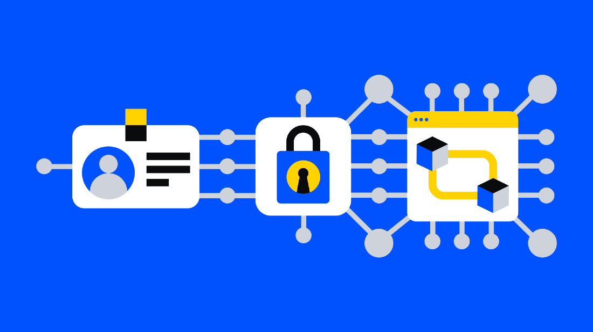
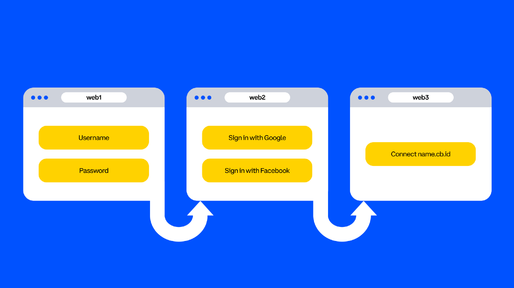

**TLDR: To create an open financial system for the world, we need to ensure web3 is usable by everyone. This means building an identity experience that’s intuitive, forgiving, and trustworthy, combining the best of web2 and web3. Our first step is to make it easy for anyone to claim a web3 (ENS) username for free, but there’s more work to be done.**

tokens or NFTs to intimidating 42-character addresses like 0x2133a64a3bE8B64827B26B08e166d0b478bd09D3. To make this easier, we worked with Ethereum Name Service (ENS) to allow users to claim “name.cb.id” usernames using Coinbase Wallet’s browser extension.

In order to create an open financial system for the world, we need to ensure that people from all walks of life can use web3. Fostering adoption of a human-readable username standard is a key part of making web3 user-friendly for everyone. With this feature, anyone can now claim a free “name.cb.id” web3 username to send and receive crypto (instead of using 42-character addresses), engage with others, and to use as the foundation of their web3 identity.

While this is an important milestone, your username is only part of your online identity. There are other identity-related gaps to fill before web3 is usable by billions of people. While web3 has early promise, it’s often unintuitive, and it lacks viable ways of conveying and assessing trust and legitimacy. To fill these gaps, we need to combine the convenience of web2 with the privacy, security, and control of web3.

# What is identity? Why does it matter?
When you create an account or sign in to a product, you’re using your identity to gain access. Identity is how products and platforms represent people, manage access and authorization, and assess trust. Identity has three core parts:

1. Representation: how you’re represented as a user (e.g. your username and profile).

2. Access: proving that you’re the owner of said identity (e.g. signing in) to get access to the product.

3. Authorization: determining what you’re allowed to access based on who you are.

With web3 today, you’re represented by a wallet address or username like nick.eth or nick.cb.id. You access web3 by using your seed phrase to configure your wallet or recover access to your wallet. Specific tokens or NFTs can authorize you to access exclusive communities, merchandise drops, and more.

# Hasn’t web2 already solved this problem?
Web2 companies have invested heavily in developing intuitive and convenient identity products. But the cracks in web2 identity are starting to show: the need to manage multiple accounts and passwords; having to fend off relentless spam; and the insidious lack of privacy, security, and control.

Many of us have exchanged privacy, security, and control for convenience. We only become aware of web2’s downsides when we’re impacted by a data breach, organizational overreach, or loss of access. But in today’s world, these events are becoming inevitabilities.

# What does web3 need to thrive?
Basic customer needs are the same for web2 and web3 identity. The difference is how they’re met. Web2 is centralized, providing convenience and flexibility at the cost of privacy, security, and control. Web3 is trustless and decentralized, but it has usability gaps. For web3 to thrive, we need to combine the best of both (flexibility and usability without sacrificing privacy, security or control) and create an experience that’s:

Intuitive. It needs to be easy for every user to transact and engage with others through human-readable usernames rather than intimidating 42-character addresses.

Forgiving. Every user needs security, and they need a way to recover access without being reliant on safely storing a sensitive recovery phrase — where a single mistake can cost someone their livelihood.

Trustworthy. People need to be able to understand whether the person or app they’re interacting with is trustworthy, and apps and people need tools to demonstrate trust to others.

# Evolving web3 identity
Web3 has the opportunity to address many of web2’s flaws. With crypto, you control the keys to your identity and your security is in your own hands. But let’s be realistic: web3 as it exists today is intimidating. So what do we, the web3 community, need to build to make the benefits of web3 available to everyone?

## An identity for the user.

We need to make it easy to define and manage portable, interoperable, human-readable usernames that sit on rich, customizable public identities ranging from anonymous to fully public. Users should be able to maintain multiple identities for different contexts (e.g. one for work and one for gaming).

Tools to help everyone stay secure and feel secure.

Today, web3 violates one of the cardinal laws of security in that our identities are vulnerable to a single point of failure: the recovery phrase. A compromised app, device, or a social engineering attack can lead to identity theft. Multi-factor authentication (MFA) is the quintessential web2 example, and web3 will need an equivalent solution that can protect every user.

## Recovery for when something goes wrong.

We’ve all forgotten a password at some point, and we shouldn’t expect recovery phrases to be any different. We can’t scale an ecosystem where losing a recovery phrase can cost someone access to their livelihood — users need ways of regaining access. Products like social recovery or the multi-party computation (MPC) technology that powers Coinbase’s dapp wallet are creating more forgiving experiences that can enable broader web3 adoption.

## Signals for trust and legitimacy.

Passports only work because governments attest to their legitimacy. The utility of web3 identity will also rely on trusted parties attesting to the legitimacy of an identity. Users will need ways of collecting, managing, and communicating “attestations” that validate their credentials and legitimacy. Applications will need ways of both issuing and verifying the legitimacy of a user’s identity and credentials.

## Interoperability across web2 and web3.

Over time, the concepts of “web2” and “web3” will blur and users who are later on the adoption curve won’t see a clear difference between the two. They will expect to be able to seamlessly access both “web2” and “web3” from a single identity and set of credentials, and we need to enable that experience. Similarly, we need to provide users with a chain-agnostic identity that they can use across all of web3.

## Building identity for web3
Building a robust web3 identity layer will require deep focus from strong teams that can build and iterate rapidly. This will often mean building and refining locally before scaling globally (and in a decentralized way). Coinbase and organizations like us need to embrace this long-term vision from the start: open source, open standards, and close collaboration with the broader web3 ecosystem.

Most importantly, we can’t lose sight of the core promise of web3 identity. We need to build in a way that prioritizes privacy, security, and control for the user while being intuitive, forgiving, and trustworthy.

We’ve started this journey with organizations like ENS and Verite to enable a free web3 identity (cb.id) for everyone, and we’ll continue expanding our identity offerings. Watch this space: this is only the beginning of an exciting new chapter for identity and web3 for Coinbase and for the web3 community at large.
