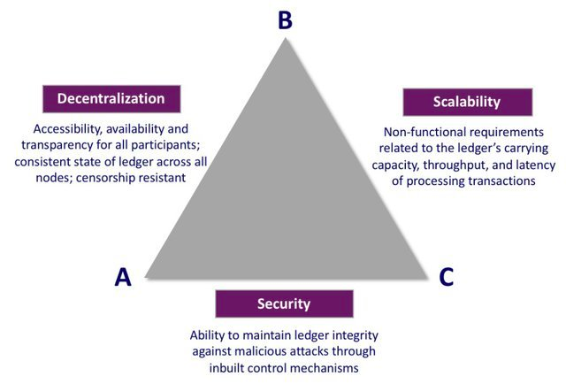

**The idea of a “modular blockchain” is becoming a category-defining narrative around scalability and blockchain infrastructure.
‍The thesis is simple: by disaggregating the core components of a Layer 1 blockchain, we can make 100x improvements on individual layers, resulting in a more scalable, composable, and decentralized system. Before we can discuss modular blockchains at length, we must understand existing blockchain architecture and the limitations blockchains face with their current implementation.**

# What is a Blockchain?
Let’s briefly recap blockchain basics. Blocks in a blockchain consist of two components: the block header, and the transaction data associated with that header. Blocks are validated through “full nodes”, which parse and compute the entire block data to ensure transactions are valid and that users aren’t sending more ether than their account balance, for instance.

Let’s also briefly outline the “layers” of functionality that compose a blockchain.

## Execution
Transactions and state changes are initially processed here. Users also typically interact with the blockchain through this layer by signing transactions, deploying smart contracts, and transferring assets.
‍

## Settlement
The settlement layer is where the execution of rollups is verified and disputes are resolved. This layer does not exist in monolithic chains and is an optional part of the modular stack. In an analogy to the U.S. court system, think of the Settlement layer as the U.S. Supreme Court, providing final arbitration on disputes.
‍

## Consensus
The consensus layer of blockchains provides ordering and finality through a network of full nodes downloading and executing the contents of blocks, and reaching consensus on the validity of state transitions.
‍

## ‍Data Availability
The data required to verify that a state transition is valid should be published and stored on this layer. This should be easily verifiable in the event of attacks where malicious block producers withhold transaction data. The data availability layer is the main bottleneck for the blockchain scalability trilemma, we’ll explore why later on.

Ethereum, for example, is monolithic, meaning the base layer handles all components mentioned above.

Blockchains currently face a problem called the “Blockchain Scalability Trilemma”. Similar to Brewer’s theorem for distributed systems, blockchain architecture typically compromises on decentralization, security, or scalability in order to provide strong guarantees for the other two.

Security refers to the ability for the network to function under attack. This principle is a core tenet of blockchains and should never be compromised, so the real tradeoff is usually between scalability and decentralization.

Let's define decentralization in the context of blockchain systems: in order for a blockchain to be decentralized, hardware requirements must not be a limitation for participation, and the resource requirements of verifying the network should be low. 

Scalability refers to a blockchain’s throughput divided by its cost to verify: the ability of a blockchain to handle an increasing amount of transactions while keeping resource requirements for verification low. There are two main ways to increase throughput. First, you can increase the block size, and therefore the capacity of transactions that can be included in a block. Unfortunately, larger block sizes result in centralization of the network as the hardware requirements of running full nodes increases in response to the need for higher computational output. Monolithic blockchains, in particular, run into this issue as an increase in throughput is correlated with an increase in the cost to verify the chain, resulting in less decentralization. Secondly, you can move execution off-chain, shifting the burden of computation away from nodes on the main network while utilizing proofs that allow the verification of computation on-chain. 

With a modular architecture, it is possible for blockchains to begin to solve the blockchain scalability trilemma through the principle of separation of concerns. Through a modular execution and data availability layer, blockchains are able to scale throughput while at the same time maintaining properties that make the network trustless and decentralized by breaking the correlation between computation and verification cost. Let’s explore how this is possible by introducing fault proofs, rollups, and how they pertain to the Data Availability problem.